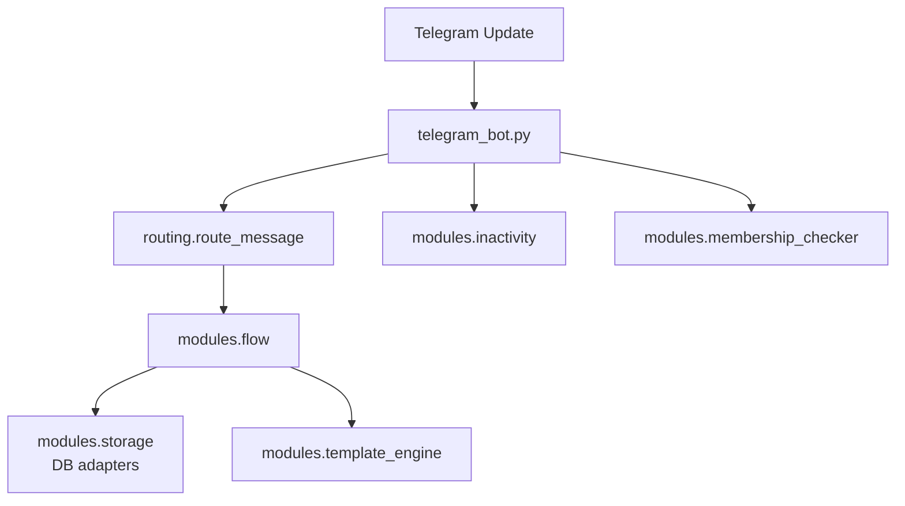
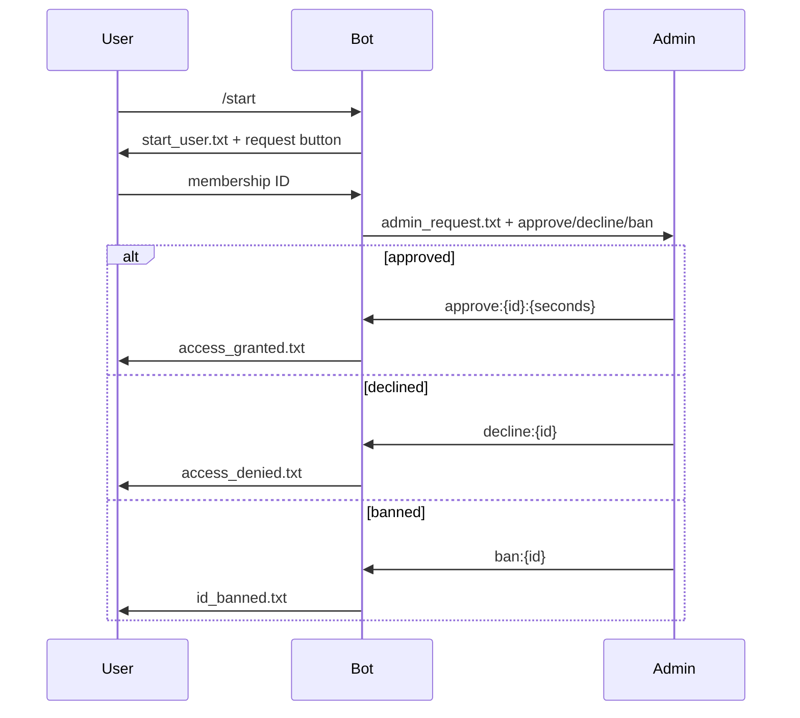

# AGENTS

## Mission & Scope
This document codifies architecture, invariants, and playbooks for the membership gate Telegram bot. All changes in this repository must comply with these rules. The scope covers the whole repository unless a deeper `AGENTS.md` overrides it (none yet).

## System Map (Mermaid)

### Component Overview

### Membership Flow

## Architectural Patterns & Invariants
- **Finite‑state routing** – Each handler MUST set `context.user_data["state"]` using `modules.states.UserState`.
- **Decorator‑based logging** – Wrap async/sync handlers with `log_async_call`/`log_sync_call` for structured logging and error boundaries.
- **Template rendering** – All user‑facing text is produced via `modules.template_engine.render_template`; never hard‑code replies.
- **Singleton config & DB** – `modules.config` and `modules.db_factory.get_db()` load YAML and database adapters once. Avoid reloading inside handlers.

## Data & Contracts
- **Database schema** (`schema/*.sql`):
  | Table | Key fields |
  |-------|------------|
  | `members` | `membership_id`, `telegram_id`, `is_confirmed`, `is_banned`, `expires_at`, `warning_sent` |
  | `admins`  | `telegram_id`, `is_top_level` |
- **Config files**: `config/ui_config.yaml` (templates & admin UI), `config/membership.yaml` (ID regex, admin buttons, expiration, session timeout). Any new keys MUST be documented and parsed in `modules/config.py`.
- **Callback data contract**: Admin buttons emit `approve:{id}:{seconds}`, `decline:{id}` or `ban:{id}`.

## Concurrency & Reliability
- The bot runs on `python-telegram-bot` asyncio loop. Heavy synchronous work MUST be offloaded with `asyncio.to_thread`.
- Background tasks `check_user_inactivity_loop` and `check_membership_expiry_loop` run via `Application.post_init`. They MUST catch and log exceptions.
- Each DB call opens its own connection; avoid sharing connections across threads.

## Testing Strategy
- Run `pytest` before committing. Tests cover config loading and SQLite adapter behaviour.

## Observability & Performance
- Use the central logger from `modules.logging_config`; `print` is prohibited.
- Enable query logging by setting `.env` `DB_LOG_QUERIES=true` when diagnosing slow SQL.
- Keep per‑update handlers lightweight to avoid blocking the event loop.

## Security & Secrets
- Secrets (`BOT_TOKEN`, DB creds, access links/chats) reside in `.env`; never commit them.
- Membership IDs are validated against regex from config; sanitize any user input before logging.

## Migration & Versioning
- Database schema lives in `schema/`; `modules.storage.db_init()` applies it. Schema changes require migration scripts for both SQLite and PostgreSQL.
- Follow [Semantic Versioning](https://semver.org/). Breaking changes require a `!` in commit message and changelog entry.

## Agent Playbooks
### Add a new message template
1. Create template file in `templates/`.
2. Reference it in `config/ui_config.yaml`.
3. Update tests if logic changes.
4. Restart bot or reload config during development.

### Support a new DB backend
1. Implement subclass of `DatabaseAdapter` in `modules/`.
2. Update `db_factory.get_db` to select it via `DB_BACKEND`.
3. Provide schema under `schema/` and tests.

## Anti‑Patterns & Pitfalls
- Forgetting to update `context.user_data["state"]` leading to improper routing.
- Hard‑coding text instead of using templates.
- Blocking the event loop with long DB operations.
- Logging secrets or personal data.

## Code Style: Git Commit Convention
Use [Conventional Commits](https://www.conventionalcommits.org/) with scopes referencing modules or docs.

| Type | Scope examples |
|------|----------------|
| `feat` | `flow`, `routing`, `db` |
| `fix` | `templates`, `config`, `tests` |
| `docs` | `readme`, `agents` |
| `refactor` | `logging`, `states` |
| `test` | `db`, `flow` |

Rules:
1. Format: `type(scope): imperative message`.
2. First line ≤72 chars. Separate body with a blank line.
3. Reference issues as `Fixes #123` in body.
4. Use `type(scope)!:` for breaking changes and describe migration steps.

## Reference Index
| File/Dir | Description |
|----------|-------------|
| `telegram_bot.py` | Application bootstrap and background tasks. |
| `modules/flow.py` | Membership request flow and admin decisions. |
| `modules/routing.py` | Routes messages and callback queries by state. |
| `modules/storage.py` | Thin wrapper around database adapters. |
| `modules/db_sqlite_adapter.py` | SQLite implementation of `DatabaseAdapter`. |
| `modules/db_postgres_adapter.py` | PostgreSQL implementation. |
| `modules/inactivity.py` | Session timeout watcher. |
| `modules/membership_checker.py` | Access expiration watcher. |
| `config/` | YAML configuration files. |
| `templates/` | Jinja2 templates for messages. |
| `tests/` | Pytest suite. |
